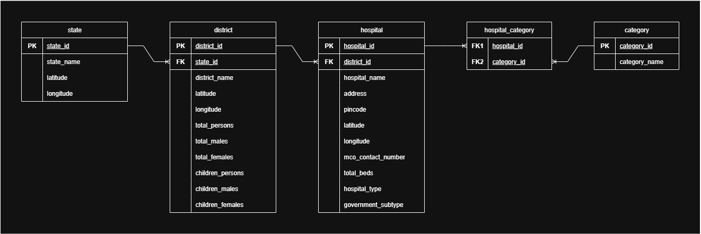

# Database Schema (Tentative)

> **Note:** This schema represents the **current phase** of the EquiHealth project, based on government data.  
> It focuses on healthcare facilities, population distribution across districts, and the service categories hospitals provide.  
> Future phases may extend it to include subcategories, surgeries, complaints, and citizen feedback.

This schema defines the **core structure** of the EquiHealth database, enabling analysis of hospital availability and service coverage across districts.

---

## Overview

The EquiHealth database is designed to capture **healthcare facility information** and **district-level population data**.  
At this stage, the schema contains **four main tables**:

1. **District**
2. **Hospital**
3. **Category**
4. **Hospital_Category (Mapping Table)**

These entities form the foundation for analyzing healthcare distribution and service coverage.

---

## Tables and Relationships

### 🗺️ District
Stores population and geographic information for each district.

| Field | Type | Description |
|-------|------|-------------|
| `district_id` | INT (PK) | Unique identifier for each district |
| `district_name` | VARCHAR | Name of the district |
| `latitude` | DECIMAL | Latitude of the district center |
| `longitude` | DECIMAL | Longitude of the district center |
| `total_persons` | INT | Total population |
| `total_males` | INT | Male population |
| `total_females` | INT | Female population |
| `children_persons` | INT | Total population under 18 (or defined age group) |
| `children_males` | INT | Male children population |
| `children_females` | INT | Female children population |

**Purpose:**  
Captures district demographics and location for mapping hospitals and analyzing service coverage.

---

### 🏥 Hospital
Stores details about healthcare facilities across districts.

| Field | Type | Description |
|-------|------|-------------|
| `hospital_id` | INT (PK) | Unique identifier for each hospital |
| `district_id` | INT (FK → District.district_id) | Reference to the district where the hospital is located |
| `hospital_name` | VARCHAR | Name of the hospital |
| `address` | VARCHAR | Full address |
| `pincode` | VARCHAR | Postal code |
| `latitude` | DECIMAL | Latitude of the hospital |
| `longitude` | DECIMAL | Longitude of the hospital |
| `mco_contact_number` | VARCHAR | Contact number of the Medical Care Officer |
| `total_beds` | INT | Number of beds available |
| `hospital_type` | VARCHAR | Type of hospital (e.g., Government, Private) |
| `government_subtype` | VARCHAR | Subtype for government hospitals, if applicable |

**Purpose:**  
Represents all hospitals in the system and links them to districts for geographic analysis.

---

### 🩺 Category
Defines medical service categories (e.g., Cardiology, Pediatrics, ICU).

| Field | Type | Description |
|-------|------|-------------|
| `category_id` | INT (PK) | Unique identifier for each category |
| `category_name` | VARCHAR | Name of the service category |

**Purpose:**  
Provides a reference list of healthcare services that hospitals can offer.

---

### 🔗 Hospital_Category
A **many-to-many mapping** between hospitals and service categories.  

| Field | Type | Description |
|-------|------|-------------|
| `hospital_id` | INT (FK → Hospital.hospital_id) | Reference to hospital |
| `category_id` | INT (FK → Category.category_id) | Reference to category |

**Primary Key:** (`hospital_id`, `category_id`)

**Purpose:**  
Enables modeling that a hospital can provide multiple service categories, and a category can exist in multiple hospitals.

---

## Relationships Summary

1. **District ↔ Hospital**  
   - **One district → Many hospitals**  
   - Each hospital belongs to a single district, enabling aggregation of services and population analysis at the district level.

2. **Hospital ↔ Category (via Hospital_Category)**  
   - **Many-to-Many relationship**  
   - A hospital can offer multiple categories (services), and each category can exist in multiple hospitals.

3. **Population & Services Integration**  
   - By linking hospitals to districts, this schema allows analysis such as:
     - Bed availability per 1,000 population in each district
     - Distribution of service categories relative to population demographics

---

## Design Decisions

- **Normalized Structure:**  
  Follows **3NF**, avoiding redundancy and maintaining clean relationships.

- **Scalable:**  
  Future tables like `subcategory`, `hospital_subcategory`, `complaints`, or `citizen_feedback` can be integrated using the same relational pattern.

- **Data Integrity:**  
  Foreign keys ensure that hospitals reference valid districts and that service mappings reference valid hospitals and categories.

---
