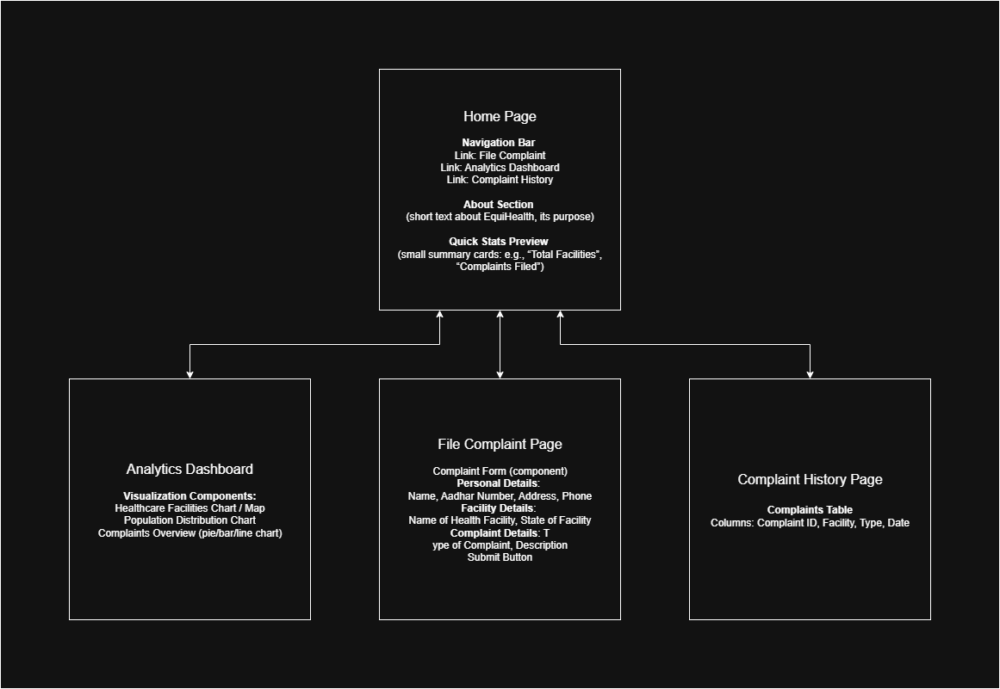

# UI Architecture (Tentative)

> **Note:** This diagram and the architecture described here are **tentative** and may evolve as the project develops.

This diagram visualizes the planned structure and flow of the EquiHealth frontend. It highlights the key pages, their major components, and how users will navigate through the platform.

## Overview

EquiHealth's frontend is designed to provide a clear, interactive, and data-driven interface for citizens and government officials:

- **Home Page:** Serves as the landing page, introducing the platform, providing quick statistics, and links to main sections.
- **File Complaint Page:** Allows users to submit complaints related to healthcare facilities. The form collects personal, facility, and complaint details.
- **Analytics Dashboard:** Displays interactive charts and maps for healthcare facilities, population distribution, and complaint overviews, supporting data-driven insights.
- **Complaint History:** Provides a searchable and sortable table of complaints, allowing users and administrators to track status and details.

## Design Decisions

- Navigation is centralized in the **NavBar** to ensure consistent access to major sections.
- Data visualization components (charts/maps) are separated from input forms for clarity.
- The complaint form fields are structured to capture **all necessary details** for efficient processing by government officials.
- Flow between pages is linear but allows quick access to any section from the NavBar.

> This architecture is **subject to change** as we finalize the frontend components and receive feedback during development.

